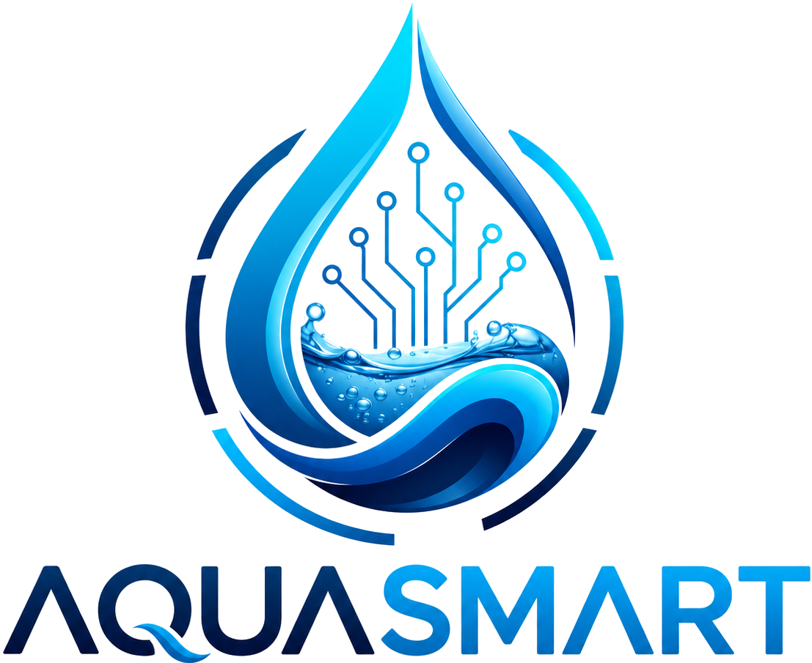
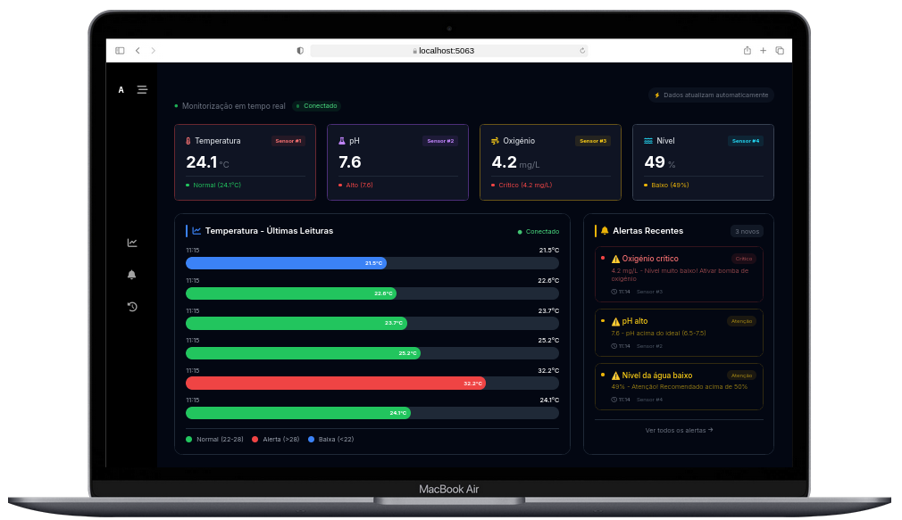

<div align="center">
  
  
  [](https://github.com/Adyllsxn/aquasmart)
  [](https://adyllsxn.github.io/aquasmart/)
  [](docs/Setup.md)
  [](LICENSE)

</div>

---

## **📖 SOBRE O PROJETO**

> O **Aquasmart** é um sistema inteligente de monitorização de aquicultura desenvolvido para evitar mortandade de peixes por falta de monitorização. Dados da água em tempo real, alertas automáticos e automatização de tanques para pequenos e médios produtores.

### **✨ Funcionalidades:**
```markdown
✅ Coleta automática de dados a cada 5 segundos
✅ Alertas visuais e sonoros quando parâmetros fogem do ideal
✅ Histórico completo com gráficos interativos
✅ Interface responsiva (PC, tablet e smartphone)
✅ Sistema open-source para pequenos e médios produtores
```

### **🔧 Fluxo de Dados**
> Sensores → PIC18F4550 → ESP8266 → Backend (.NET) → Dashboard (Blazor)

---

## **🛠️ TECNOLOGIAS**

| Camada | Tecnologias |
|--------|-------------|
| **Backend** | C# .NET 10, ASP.NET Core, Entity Framework Core, PostgreSQL, SignalR, Scalar |
| **Frontend** | Blazor WebAssembly, Blazorise Tailwind, Blazorise Icons FontAwesome |
| **Hardware** | PIC18F4550, ESP8266, DS18B20 (Temperatura), SEN0161 (pH), DO-9542 (Oxigénio), HC-SR04 (Nível) |

---


## **📸 DEMO**
<div align="center">  <br /> <i>Interface principal com gráficos de temperatura, pH e alertas em tempo real</i> </div>

---

## **📄 LICENÇA**

> Este projeto está sob a licença MIT, o que significa que é de código aberto e pode ser utilizado livremente para fins académicos e comerciais, desde que mantidos os créditos.

```markdown
📚 Código aberto (open source)
✅ Livre para uso académico
🤝 Contribuições são bem-vindas
```